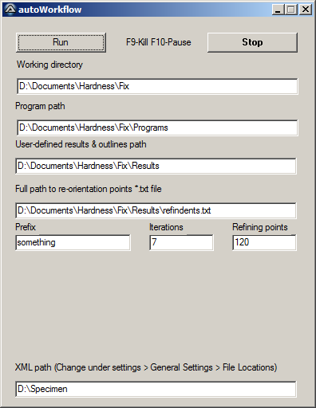

# Synopsis
This set of scripts and functions meant to provide utilities for performing and visualizing hardness maps, predominantly for automated hardness testers using MATLAB. The contained code is meant for extending the capabilities of the Struers DuraScan series of automated hardness testers, but can be extended to operate on any automated hardness tester which has a CNC stage.

This is accomplished by first outlining the specimen/domain that you wish to indent using machine coordinates, placing a few reference indents and then meshing using the [Distmesh](http://persson.berkeley.edu/distmesh/) code by Per-Olof Persson. Indents will then be specified at node locations in the resulting mesh.

After this initial map is submitted and completed by the hardness tester, the results file will be analysed, and the initial mesh can then be iterated/refined to place further indents in elements with the highest gradients. Refinement is accomplished via MATLAB

This is useful for determining boundaries/regions of relatively high hardness compared to their surroundings as opposed to using a fixed indent density. This includes, but is not limited to welds, forgings and fracture specimens.

# Main Utilities
There are two main scrips to generate/refine maps, `MapSetup.m` and `MapRefine.m`, and a third `MapShow.m` for visualisation. Note that `MapShow.m` is meant for singular/unrefined maps as generated by using `MapSetup.m`. `MapRefine.m` contains all of the elements of `MapShow.m`.

## MapSetup
There are 11 parameters required for setting up a map, which are defined at the beginning of the script:
~~~matlab
distFactor=3; %default
seed=2; %mm, or set seed=int16(number of seeds)
Prefix='MyAnalysis';
speOut=strcat('Programs\',Prefix); %path & prefix of new file
RefIndent='Results_Outlines\TryReorient.spe';
PeriOutline='Results_Outlines\OverviewOutline_Conv.txt';
DomainOutline='Results_Outlines\EvaluationOutline_Conv.txt';
AddPoints='Results_Outlines\Already_done.txt';
AddPointsLoad=1;
demo=0; %make equal to 1 or true to see indent sequence
doOver=1; %if false, it will only load the contents of <Prefix>_setup.mat
~~~
The `distFactor` parameter corresponds to the ISO/ASTM definition for minimum indent spacing, usually in the range of 2.5-7 times the largest indent. The `seed` parameter can either be the physical distance between seeds in mm along the perimeter of the domain to be mapped, or can be a set number of seeds (passed as an `int16` type). `Prefix` is merely a unique identifier to describe the analysis, `speOut` is the relative path and name where the program to be interpreted by the hardness tester will be written. `RefIndent` is the location of the results file containing the reference indents. `PeriOutline` is a text file containing whitespace delimited x,y pairs, one point per line, which describes a domain to be tracked along with the map; for example, the outline of the overall specimen. `DomainOutline` points to the actual outline to meshed/mapped. `AddPoints` and `AddPoints` refers to the location and load which any additional, pre-existing indents have been performed which may lie in the area intended for mapping. The format for this file is `x y hardness value`, whitespace delimited, one indent per line. The `demo` parameter if true will show the sequence with which the indents will be performed; this is *very slow for large maps*. The `doOver` parameter if true, will bypass meshing and load a pre-existing mesh if it exists.

Changing the load with which to indent is accomplished via either changing an argument in `writeDuraRows.m` or by manually modifying the parameters in the hardness tester control software.

**Note that all input files for this script must use the same coordinate system.**

This will generate a series of images describing the reference indent locations, the mesh, along with predicted plastically affected zones based on reference indents. A MATLAB workspace file `*.mat` containing the mesh information will be written to the current path, with the program file written elsewhere. Once the program file has been submitted and run successfully, the results can be either refined via `MapRefine.m` or visualized via `MapShow.m`.

## MapRefine
There are 6 main parameters to be identified at the beginning of the script:
~~~matlab
NumRefiningPnts=150;
Prefix='MyAnalysis';
speOut=strcat('Programs\',Prefix); %local path & prefix of new spe
% LastRunWorkspace='SomeSampleName_meshed_setup.mat';
LastRunWorkspace='SomeSampleName_1_setup.mat';
% LastRunResults='Results_Outlines\SomeSampleName_meshed - 5.11.2015 20h7min37s.spe';
LastRunResults='Results_Outlines\SomeSampleName_1 - 13.11.2015 18h21min47s.spe';
RefLoc='Results_Outlines\Relocation_1.txt'; %change to valid path/file name accordingly.
~~~
The `NumRefininingPnts` is how many additional points there are to be added to the map, `Prefix` the same as `MapSetup.m`, `LastRunWorkspace` identifies the `*.mat` file corresponding to the last run analysis. For example, if this is the first refinement beyond the intial, then the `LastRunWorkspace` parameter will be `<Prefix>_setup.mat`. If this is the second time refining, then this parameter will be `<Prefix>_1_setup.mat`. The same principle applies to `LastRunResults`, which points to the hardness tester generated results file for analysis. The `RefLoc` parameter describes new positions of reference indents (if applicable), with the format of `Number x y`, whitespace delimited, one reference indent per line where the number corresponds to the sequence in which they were originally performed.

This script will first start by reading in the mesh, reorienting it to the new coordinate system (if `RefLoc` is a valid file) and appending hardness values to nodal locations. It will then sort the elements in the mesh according to gradient, with the first `NumRefininingPnts` elements tested for an additional indent and refined mesh. If the plastic zones do not intersect (based on the softest point in the element), then the mesh refinement occurs, and the point is passed to a program for the hardness tester to interpret.

A series of figures will be produced, including a contour plot of the hardness variation and representations of initial and refined mesh, along with locations identified for refinement.

## MapShow
The `MapShow.m` utility is used to provide a contour map of interpolated hardness values across a singular map. The following describes parameters to be modified:
~~~matlab
R=0; %rotation of the outline/results about the centroid (degrees)
outline='SomeDirectory\MyOutline.txt'; %path and file name for outline
result='SomeDirectory\MyResults.spe'; %path and file name for corresponding *.spe
outprefix='SomePrefix'; %Prefix of output intermediate_<Prefix>.mat
redo = 1; %boolean - true: discard existing .mat, -false: load .mat file
ScaleBarLength=5; %mm (or 0 for no scalebar)
~~~
Note that this script does not read/operate on a refined hardness map, it is meant for visualising a singular batch of results.

# Fully automated mode
An AutoIt script/GUI has been developed to work with the automated hardness tester GUI to permit full lights-out automated refinement. Due to the vagaries/peculiarities of running MATLAB from the commandline, there are separate versions of the MATLAB scripts for refinement. The files which correspond to this utility are:
- `autoWorkFlow.au3`
- `MapRefineAuto.m`

Once `MapSetup.m` has been run, then the parameters are used in the `autoWorkFlow.au3` GUI. Running this GUI will control the various stages of the refinement process, taking in the various parameters such as file paths/prefixes, submitting the job to the hardness tester by actuating the control software programmatically and subsequently running MATLAB once the analysis is complete.

  
* AutoIt GUI for fully automated map refinement.*

# Tested versions
These scripts have been tested using:
- MATLAB 8.1.0.604 (R2013a)
- AutoIt v3
- ecos Workflow v2.11.0 (hardness tester control software/GUI)

# Thanks
A big thank you goes out to Per-Olof Persson for writing Distmesh and Angus Johnson for the  [Clipper Library](http://persson.berkeley.edu/distmesh/) for some really great polygon tools.

# Disclaimer & Warning
The code contained herein is not supported by EmcoTest or Struers or any part of their respective organisations. This repository is meant to extend functionality currently missing which may or may not be suitable for all combinations of material and equipment. Use of this code can result in a seriously damaged test facility or operator injury. Use at your own risk.

